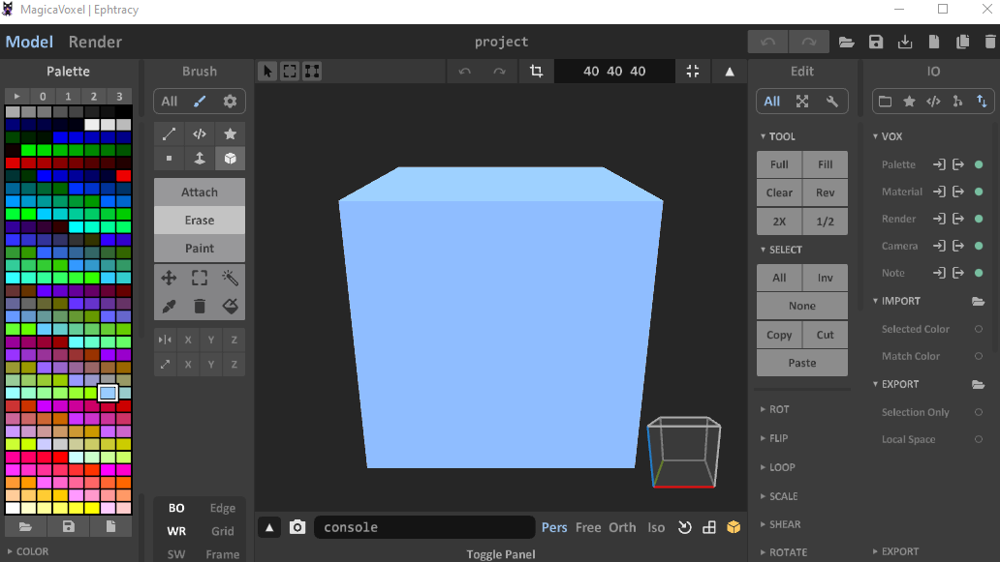
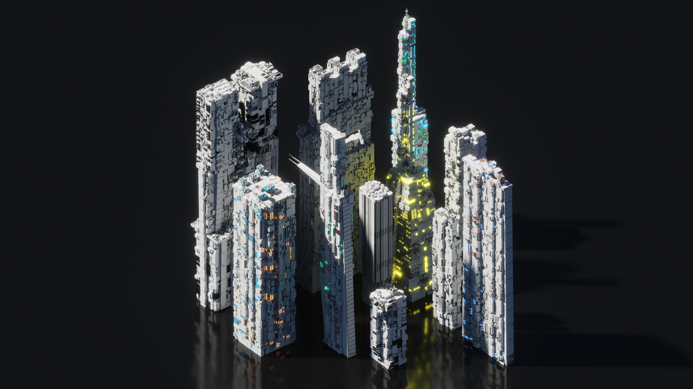

# What is VoxMerger ? 

VoxMerger is a console program (Windows only) which can merge multiple MagicaVoxel scenes (.vox) into one.

VoxMerger keep only colors really used from your models and keep materials settings. If the sum of your colors in all your models is higher than 256, it will keep only the first 256 colors. So optimize your palette before merging. 

## WARNING: VoxMerger is deprecated !

MagicaVoxel now support the importation of a complex .vox from the IO Panel

# Usage

- You need to open a console (like cmd or Powershell in Windows)
- Go to the emplacement of the binary
- Launch the command : `./VoxMerger.exe --i [INPUT] --o [OUTPUT]`
- [INPUT] refer to a folder filepath (mandatory)
- [OUTPUT] refer to the destination path (mandatory)

